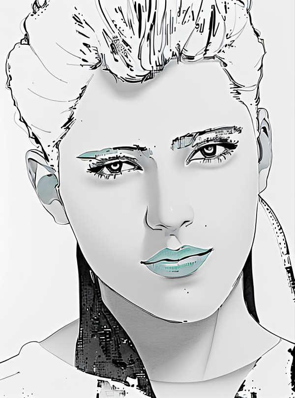

# Img2lineart
Turns images into line art.

## Installation
- install [stable diffusion webui](https://github.com/AUTOMATIC1111/stable-diffusion-webui) with this commit: 82a973c04367123ae98bd9abdf80d9eda9b910e2
- download control net and diffusion checkpoint:
    - [dreamshaper_8.safetensors](https://civitai.com/models/4384/dreamshaper)
    - [control_canny-fp16](https://huggingface.co/webui/ControlNet-modules-safetensors/tree/main)
- start diffusion server with
```bash
# NOTE: remove --nowebui for gui; copy url to webui_server_url below
bash webui.sh --api --nowebui
```

## TODO
- [ ] Use a LLM to add the description of the image into the prompt; if not; too difficult for the model

## Usage
```python
from img2line.sd_api import SDAPI_config
img = # np array or image path (str)
sd = SDAPI_config(webui_server_url="http://127.0.0.1:7860").setup()
out = sd.to_lineart(img, out_sz=512, seed=32)
```

## Example input/output
<p float="left">
    
    
</p>

## Acknowlegement
[stable diffusion webui api example](https://github.com/AUTOMATIC1111/stable-diffusion-webui/wiki/API)  
[youtube tutorial inspiration](https://www.youtube.com/watch?v=xlO1Av20-OY)